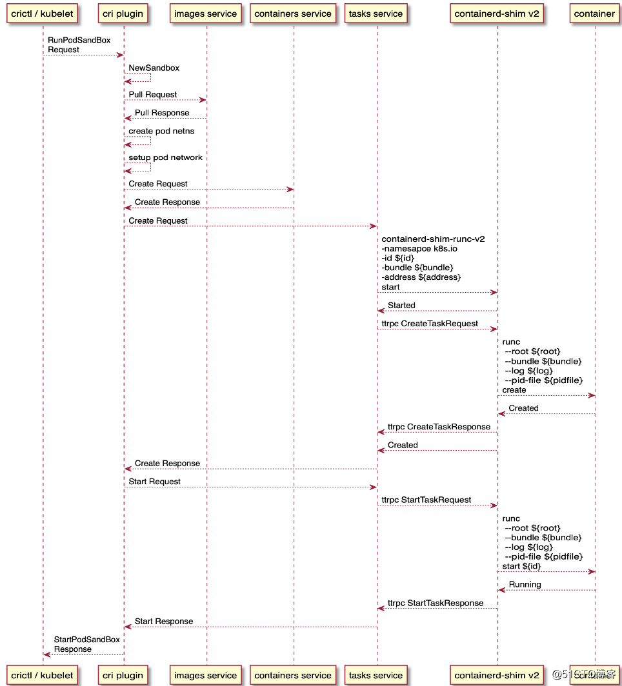

# CRI Plugin代码分析
> CRI（Container Runtime Interface）是 Kubernetes 定义的与 contianer runtime 进行交互的接口<br>
> Containerd在1.1版本直接将cri-containerd内置在Containerd中，作为一个Plugin插件<br>
> CRI插件实现了Kubelet CRI 接口中的 Image Service 和 Runtime Service，管理容器和镜像，调用CNI插件给Pod配置网络


## [外部服务](https://github.com/containerd/containerd/blob/main/pkg/cri/cri.go)
```diff
// Register CRI service plugin
func init() {
	config := criconfig.DefaultConfig()
	plugin.Register(&plugin.Registration{
		Type:   plugin.GRPCPlugin,
		ID:     "cri",
		Config: &config,
		Requires: []plugin.Type{
			plugin.EventPlugin,
			plugin.ServicePlugin,
		},
+		InitFn: initCRIService,
	})
}
```
> DefaultConfig
```diff
// DefaultConfig returns default configurations of cri plugin.
func DefaultConfig() PluginConfig {
	defaultRuncV2Opts := `
	# NoPivotRoot disables pivot root when creating a container.
	NoPivotRoot = false
	# NoNewKeyring disables new keyring for the container.
	NoNewKeyring = false
	# ShimCgroup places the shim in a cgroup.
	ShimCgroup = ""
	# IoUid sets the I/O's pipes uid.
	IoUid = 0
	# IoGid sets the I/O's pipes gid.
	IoGid = 0
	# BinaryName is the binary name of the runc binary.
	BinaryName = ""
	# Root is the runc root directory.
	Root = ""
	# CriuPath is the criu binary path.
	CriuPath = ""
	# SystemdCgroup enables systemd cgroups.
	SystemdCgroup = false
	# CriuImagePath is the criu image path
	CriuImagePath = ""
	# CriuWorkPath is the criu work path.
	CriuWorkPath = ""
`
	tree, _ := toml.Load(defaultRuncV2Opts)
	return PluginConfig{
		CniConfig: CniConfig{
			NetworkPluginBinDir:       "/opt/cni/bin",
			NetworkPluginConfDir:      "/etc/cni/net.d",
			NetworkPluginMaxConfNum:   1, // only one CNI plugin config file will be loaded
			NetworkPluginConfTemplate: "",
		},
		ContainerdConfig: ContainerdConfig{
			Snapshotter:        containerd.DefaultSnapshotter,
			DefaultRuntimeName: "runc",
			NoPivot:            false,
			Runtimes: map[string]Runtime{
				"runc": {
					Type:    "io.containerd.runc.v2",
					Options: tree.ToMap(),
				},
			},
			DisableSnapshotAnnotations: true,
		},
		DisableTCPService:    true,
		StreamServerAddress:  "127.0.0.1",
		StreamServerPort:     "0",
		StreamIdleTimeout:    streaming.DefaultConfig.StreamIdleTimeout.String(), // 4 hour
		EnableSelinux:        false,
		SelinuxCategoryRange: 1024,
		EnableTLSStreaming:   false,
		X509KeyPairStreaming: X509KeyPairStreaming{
			TLSKeyFile:  "",
			TLSCertFile: "",
		},
+		SandboxImage:                     "k8s.gcr.io/pause:3.6",
		StatsCollectPeriod:               10,
		SystemdCgroup:                    false,
		MaxContainerLogLineSize:          16 * 1024,
		MaxConcurrentDownloads:           3,
		DisableProcMount:                 false,
		TolerateMissingHugetlbController: true,
		DisableHugetlbController:         true,
		IgnoreImageDefinedVolumes:        false,
		ImageDecryption: ImageDecryption{
			KeyModel: KeyModelNode,
		},
	}
}
```
> initCRIService
```diff
func initCRIService(ic *plugin.InitContext) (interface{}, error) {
	ic.Meta.Platforms = []imagespec.Platform{platforms.DefaultSpec()}
	ic.Meta.Exports = map[string]string{"CRIVersion": constants.CRIVersion, "CRIVersionAlpha": constants.CRIVersionAlpha}
	ctx := ic.Context
	pluginConfig := ic.Config.(*criconfig.PluginConfig)
	if err := criconfig.ValidatePluginConfig(ctx, pluginConfig); err != nil {
		return nil, errors.Wrap(err, "invalid plugin config")
	}

	c := criconfig.Config{
		PluginConfig:       *pluginConfig,
		ContainerdRootDir:  filepath.Dir(ic.Root),
		ContainerdEndpoint: ic.Address,
		RootDir:            ic.Root,
		StateDir:           ic.State,
	}
	log.G(ctx).Infof("Start cri plugin with config %+v", c)

	setGLogLevel()

-	// 因为是建立一个新的server，它map了一大批依赖服务，
+	servicesOpts, err := getServicesOpts(ic)

	log.G(ctx).Info("Connect containerd service")
	client, err := containerd.New(
		"",
		containerd.WithDefaultNamespace(constants.K8sContainerdNamespace),
		containerd.WithDefaultPlatform(platforms.Default()),
		containerd.WithServices(servicesOpts...),
	)
+	s, err := server.NewCRIService(c, client)

	go func() {
+		s.Run()
		// TODO(random-liu): Whether and how we can stop containerd.
	}()
	return s, nil
}

// getServicesOpts get service options from plugin context.
func getServicesOpts(ic *plugin.InitContext) ([]containerd.ServicesOpt, error) {
	plugins, err := ic.GetByType(plugin.ServicePlugin)
	if err != nil {
		return nil, errors.Wrap(err, "failed to get service plugin")
	}

	ep, err := ic.Get(plugin.EventPlugin)
	if err != nil {
		return nil, errors.Wrap(err, "failed to get event plugin")
	}

	opts := []containerd.ServicesOpt{
		containerd.WithEventService(ep.(containerd.EventService)),
	}
-	// 生成修改Service的闭包Map	
+	for s, fn := range map[string]func(interface{}) containerd.ServicesOpt{
		services.ContentService: func(s interface{}) containerd.ServicesOpt {
			return containerd.WithContentStore(s.(content.Store))
		},
		services.ImagesService: func(s interface{}) containerd.ServicesOpt {
			return containerd.WithImageClient(s.(images.ImagesClient))
		},
		services.SnapshotsService: func(s interface{}) containerd.ServicesOpt {
			return containerd.WithSnapshotters(s.(map[string]snapshots.Snapshotter))
		},
		services.ContainersService: func(s interface{}) containerd.ServicesOpt {
			return containerd.WithContainerClient(s.(containers.ContainersClient))
		},
		services.TasksService: func(s interface{}) containerd.ServicesOpt {
			return containerd.WithTaskClient(s.(tasks.TasksClient))
		},
		services.DiffService: func(s interface{}) containerd.ServicesOpt {
			return containerd.WithDiffClient(s.(diff.DiffClient))
		},
		services.NamespacesService: func(s interface{}) containerd.ServicesOpt {
			return containerd.WithNamespaceClient(s.(namespaces.NamespacesClient))
		},
		services.LeasesService: func(s interface{}) containerd.ServicesOpt {
			return containerd.WithLeasesService(s.(leases.Manager))
		},
		services.IntrospectionService: func(s interface{}) containerd.ServicesOpt {
			return containerd.WithIntrospectionClient(s.(introspectionapi.IntrospectionClient))
		},
	} {
		p := plugins[s]
		i, err := p.Instance()
-		// 得到service的instance，并生成ServiceOpt
+		opts = append(opts, fn(i))
	}
	return opts, nil
}
```

### criService
- criService是整个CRI plugin的处理核心，它实现了CRI接口，包括RuntimeServiceServer和ImageServiceServer
```diff
// grpcServices are all the grpc services provided by cri containerd.
type grpcServices interface {
	runtime.RuntimeServiceServer
	runtime.ImageServiceServer
}

// CRIService is the interface implement CRI remote service server.
type CRIService interface {
	Run() error
	// io.Closer is used by containerd to gracefully stop cri service.
	io.Closer
	plugin.Service
	grpcServices
}
```
```diff
// NewCRIService returns a new instance of CRIService
func NewCRIService(config criconfig.Config, client *containerd.Client) (CRIService, error) {
	var err error
	labels := label.NewStore()
	c := &criService{
		config:             config,
		client:             client,
		os:                 osinterface.RealOS{},
		sandboxStore:       sandboxstore.NewStore(labels),
		containerStore:     containerstore.NewStore(labels),
		imageStore:         imagestore.NewStore(client),
		snapshotStore:      snapshotstore.NewStore(),
		sandboxNameIndex:   registrar.NewRegistrar(),
		containerNameIndex: registrar.NewRegistrar(),
		initialized:        atomic.NewBool(false),
	}

+	client.SnapshotService(c.config.ContainerdConfig.Snapshotter)
+	c.imageFSPath = imageFSPath(config.ContainerdRootDir, config.ContainerdConfig.Snapshotter)
	logrus.Infof("Get image filesystem path %q", c.imageFSPath)

+	c.initPlatform()

	// prepare streaming server
+	c.streamServer, err = newStreamServer(c, config.StreamServerAddress, config.StreamServerPort, config.StreamIdleTimeout)

	c.eventMonitor = newEventMonitor(c)

+	c.cniNetConfMonitor, err = newCNINetConfSyncer(c.config.NetworkPluginConfDir, c.netPlugin, c.cniLoadOptions())

	// Preload base OCI specs
+	c.baseOCISpecs, err = loadBaseOCISpecs(&config)
	return c, nil
}
```
> ***c.initPlatform***
```
// initPlatform handles linux specific initialization for the CRI service.
func (c *criService) initPlatform() error {
	var err error
	
	// Pod needs to attach to at least loopback network and a non host network,
	// hence networkAttachCount is 2. If there are more network configs the
	// pod will be attached to all the networks but we will only use the ip
	// of the default network interface as the pod IP.
	c.netPlugin, err = cni.New(cni.WithMinNetworkCount(networkAttachCount),
		cni.WithPluginConfDir(c.config.NetworkPluginConfDir),
		cni.WithPluginMaxConfNum(c.config.NetworkPluginMaxConfNum),
		cni.WithPluginDir([]string{c.config.NetworkPluginBinDir}))
	if c.allCaps == nil {
		c.allCaps, err = cap.Current()
	}

	return nil
}
```

> ***loadBaseOCISpecs***
```diff
func loadOCISpec(filename string) (*oci.Spec, error) {
	file, err := os.Open(filename)
	defer file.Close()
	spec := oci.Spec{}
	json.NewDecoder(file).Decode(&spec)
	return &spec, nil
}

func loadBaseOCISpecs(config *criconfig.Config) (map[string]*oci.Spec, error) {
	specs := map[string]*oci.Spec{}
	for _, cfg := range config.Runtimes {
		if cfg.BaseRuntimeSpec == "" {
			continue
		}

		// Don't load same file twice
		if _, ok := specs[cfg.BaseRuntimeSpec]; ok {
			continue
		}

		spec, err := loadOCISpec(cfg.BaseRuntimeSpec)
		specs[cfg.BaseRuntimeSpec] = spec
	}

	return specs, nil
}
```

### 启动CRI服务
```diff
// Run starts the CRI service.
func (c *criService) Run() error {
	logrus.Info("Start subscribing containerd event")
	c.eventMonitor.subscribe(c.client)

	logrus.Infof("Start recovering state")
	if err := c.recover(ctrdutil.NamespacedContext()); err != nil {
		return errors.Wrap(err, "failed to recover state")
	}

	// Start event handler.
	logrus.Info("Start event monitor")
	eventMonitorErrCh := c.eventMonitor.start()

	// Start snapshot stats syncer, it doesn't need to be stopped.
	logrus.Info("Start snapshots syncer")
	snapshotsSyncer := newSnapshotsSyncer(
		c.snapshotStore,
		c.client.SnapshotService(c.config.ContainerdConfig.Snapshotter),
		time.Duration(c.config.StatsCollectPeriod)*time.Second,
	)
	snapshotsSyncer.start()

	// Start CNI network conf syncer
	logrus.Info("Start cni network conf syncer")
	cniNetConfMonitorErrCh := make(chan error, 1)
	go func() {
		defer close(cniNetConfMonitorErrCh)
		cniNetConfMonitorErrCh <- c.cniNetConfMonitor.syncLoop()
	}()

	// Start streaming server.
	logrus.Info("Start streaming server")
	streamServerErrCh := make(chan error)
	go func() {
		defer close(streamServerErrCh)
		c.streamServer.Start(true)
	}()

	// Set the server as initialized. GRPC services could start serving traffic.
	c.initialized.Set()

	var eventMonitorErr, streamServerErr, cniNetConfMonitorErr error
	// Stop the whole CRI service if any of the critical service exits.
	select {
	case eventMonitorErr = <-eventMonitorErrCh:
	case streamServerErr = <-streamServerErrCh:
	case cniNetConfMonitorErr = <-cniNetConfMonitorErrCh:
	}
	c.Close()
	// If the error is set above, err from channel must be nil here, because
	// the channel is supposed to be closed. Or else, we wait and set it.
	if err := <-eventMonitorErrCh; err != nil {
		eventMonitorErr = err
	}
	logrus.Info("Event monitor stopped")
	// There is a race condition with http.Server.Serve.
	// When `Close` is called at the same time with `Serve`, `Close`
	// may finish first, and `Serve` may still block.
	// See https://github.com/golang/go/issues/20239.
	// Here we set a 2 second timeout for the stream server wait,
	// if it timeout, an error log is generated.
	// TODO(random-liu): Get rid of this after https://github.com/golang/go/issues/20239
	// is fixed.
	const streamServerStopTimeout = 2 * time.Second
	select {
	case err := <-streamServerErrCh:
		logrus.Info("Stream server stopped")
	case <-time.After(streamServerStopTimeout):
		logrus.Errorf("Stream server is not stopped in %q", streamServerStopTimeout)
	}
	return nil
}
```

- 服务注册
```diff
func (c *criService) register(s *grpc.Server) error {
	instrumented := newInstrumentedService(c)
	runtime.RegisterRuntimeServiceServer(s, instrumented)
	runtime.RegisterImageServiceServer(s, instrumented)
	instrumentedAlpha := newInstrumentedAlphaService(c)
	runtime_alpha.RegisterRuntimeServiceServer(s, instrumentedAlpha)
	runtime_alpha.RegisterImageServiceServer(s, instrumentedAlpha)
	return nil
}

- instrumentedService实现了CRI接口的RuntimeService和ImageSerivce
func newInstrumentedService(c *criService) grpcServices {
	return &instrumentedService{c: c}
}

// instrumentedService wraps service with containerd namespace and logs.
type instrumentedService struct {
	c *criService
}
```

## CRI接口实现
- CRI Sandbox
```diff
// Sandbox contains all resources associated with the sandbox. All methods to
// mutate the internal state are thread safe.
type Sandbox struct {
	// Metadata is the metadata of the sandbox, it is immutable after created.
	Metadata
	// Status stores the status of the sandbox.
	Status StatusStorage
	// Container is the containerd sandbox container client.
	Container containerd.Container
	// CNI network namespace client.
	// For hostnetwork pod, this is always nil;
	// For non hostnetwork pod, this should never be nil.
	NetNS *netns.NetNS
	// StopCh is used to propagate the stop information of the sandbox.
	*store.StopCh
}

// NewSandbox creates an internally used sandbox type. This functions reminds
// the caller that a sandbox must have a status.
func NewSandbox(metadata Metadata, status Status) Sandbox {
	s := Sandbox{
		Metadata: metadata,
		Status:   StoreStatus(status),
		StopCh:   store.NewStopCh(),
	}
	if status.State == StateNotReady {
		s.Stop()
	}
	return s
}

// Store stores all sandboxes.
type Store struct {
	lock      sync.RWMutex
	sandboxes map[string]Sandbox
	idIndex   *truncindex.TruncIndex
	labels    *label.Store
}

// NewStore creates a sandbox store.
func NewStore(labels *label.Store) *Store {
	return &Store{
		sandboxes: make(map[string]Sandbox),
		idIndex:   truncindex.NewTruncIndex([]string{}),
		labels:    labels,
	}
}

// Add a sandbox into the store.
func (s *Store) Add(sb Sandbox) error {
	s.lock.Lock()
	defer s.lock.Unlock()
	if _, ok := s.sandboxes[sb.ID]; ok {
		return errdefs.ErrAlreadyExists
	}
	s.labels.Reserve(sb.ProcessLabel)
	s.idIndex.Add(sb.ID)
	s.sandboxes[sb.ID] = sb
	return nil
}

// Get returns the sandbox with specified id.
// Returns store.ErrNotExist if the sandbox doesn't exist.
func (s *Store) Get(id string) (Sandbox, error) {
	s.lock.RLock()
	defer s.lock.RUnlock()
	id, err := s.idIndex.Get(id)
	sb, ok := s.sandboxes[id]
	return Sandbox{}, errdefs.ErrNotFound
}

// List lists all sandboxes.
func (s *Store) List() []Sandbox {
	s.lock.RLock()
	defer s.lock.RUnlock()
	var sandboxes []Sandbox
	for _, sb := range s.sandboxes {
		sandboxes = append(sandboxes, sb)
	}
	return sandboxes
}
```

- CRI Container
```diff
// Container contains all resources associated with the container. All methods to
// mutate the internal state are thread-safe.
type Container struct {
	// Metadata is the metadata of the container, it is **immutable** after created.
	Metadata
	// Status stores the status of the container.
	Status StatusStorage
	// Container is the containerd container client.
	Container containerd.Container
	// Container IO.
	// IO could only be nil when the container is in unknown state.
	IO *cio.ContainerIO
	// StopCh is used to propagate the stop information of the container.
	*store.StopCh
	// IsStopSignaledWithTimeout the default is 0, and it is set to 1 after sending
	// the signal once to avoid repeated sending of the signal.
	IsStopSignaledWithTimeout *uint32
}

// Store stores all Containers.
type Store struct {
	lock       sync.RWMutex
	containers map[string]Container
	idIndex    *truncindex.TruncIndex
	labels     *label.Store
}

// NewStore creates a container store.
func NewStore(labels *label.Store) *Store {
	return &Store{
		containers: make(map[string]Container),
		idIndex:    truncindex.NewTruncIndex([]string{}),
		labels:     labels,
	}
}

// Add a container into the store. Returns store.ErrAlreadyExist if the
// container already exists.
func (s *Store) Add(c Container) error {
	s.lock.Lock()
	defer s.lock.Unlock()
	s.containers[c.ID]
	s.labels.Reserve(c.ProcessLabel)
	s.idIndex.Add(c.ID)
	s.containers[c.ID] = c
	return nil
}

// Get returns the container with specified id. Returns store.ErrNotExist
// if the container doesn't exist.
func (s *Store) Get(id string) (Container, error) {
	s.lock.RLock()
	defer s.lock.RUnlock()
	id, err := s.idIndex.Get(id)
	if c, ok := s.containers[id]; ok {
		return c, nil
	}
	return Container{}, errdefs.ErrNotFound
}

// List lists all containers.
func (s *Store) List() []Container {
	s.lock.RLock()
	defer s.lock.RUnlock()
	var containers []Container
	for _, c := range s.containers {
		containers = append(containers, c)
	}
	return containers
}
```

- CRI Image
```diff
type Image struct {
	// Id of the image. Normally the digest of image config.
	ID string
	// References are references to the image, e.g. RepoTag and RepoDigest.
	References []string
	// ChainID is the chainID of the image.
	ChainID string
	// Size is the compressed size of the image.
	Size int64
	// ImageSpec is the oci image structure which describes basic information about the image.
	ImageSpec imagespec.Image
}

// Store stores all images.
type Store struct {
	lock sync.RWMutex
	// refCache is a containerd image reference to image id cache.
	refCache map[string]string
	// client is the containerd client.
	client *containerd.Client
	// store is the internal image store indexed by image id.
	store *store
}

type store struct {
	lock      sync.RWMutex
	images    map[string]Image
	digestSet *digestset.Set
}

func (s *store) list() []Image {
	s.lock.RLock()
	defer s.lock.RUnlock()
	var images []Image
	for _, i := range s.images {
		images = append(images, i)
	}
	return images
}

func (s *store) add(img Image) error {
	s.lock.Lock()
	defer s.lock.Unlock()
	if _, err := s.digestSet.Lookup(img.ID); err != nil {
		s.digestSet.Add(imagedigest.Digest(img.ID))

	i, ok := s.images[img.ID]
	if !ok {
		// If the image doesn't exist, add it.
		s.images[img.ID] = img
		return nil
	}
	// Or else, merge and sort the references.
	i.References = sortReferences(util.MergeStringSlices(i.References, img.References))
	s.images[img.ID] = i
	return nil
}


// NewStore creates an image store.
func NewStore(client *containerd.Client) *Store {
	return &Store{
		refCache: make(map[string]string),
		client:   client,
		store: &store{
			images:    make(map[string]Image),
			digestSet: digestset.NewSet(),
		},
	}
}

// Update updates cache for a reference.
func (s *Store) Update(ctx context.Context, ref string) error {
	s.lock.Lock()
	defer s.lock.Unlock()
	i, err := s.client.GetImage(ctx, ref)
	if err != nil && !errdefs.IsNotFound(err) {
		return errors.Wrap(err, "get image from containerd")
	}
	var img *Image
	if err == nil {
		img, err = getImage(ctx, i)
		if err != nil {
			return errors.Wrap(err, "get image info from containerd")
		}
	}
	return s.update(ref, img)
}

// update updates the internal cache. img == nil means that
// the image does not exist in containerd.
func (s *Store) update(ref string, img *Image) error {
	oldID, oldExist := s.refCache[ref]
	if img == nil {
		// The image reference doesn't exist in containerd.
		if oldExist {
			// Remove the reference from the store.
			s.store.delete(oldID, ref)
			delete(s.refCache, ref)
		}
		return nil
	}
	if oldExist {
		if oldID == img.ID {
			return nil
		}
		// Updated. Remove tag from old image.
		s.store.delete(oldID, ref)
	}
	// New image. Add new image.
	s.refCache[ref] = img.ID
	return s.store.add(*img)
}

// getImage gets image information from containerd.
func getImage(ctx context.Context, i containerd.Image) (*Image, error) {
	// Get image information.
	diffIDs, err := i.RootFS(ctx)
	chainID := imageidentity.ChainID(diffIDs)

	size, err := i.Size(ctx)
	desc, err := i.Config(ctx)
	id := desc.Digest.String()

	rb, err := content.ReadBlob(ctx, i.ContentStore(), desc)
	var ociimage imagespec.Image
	json.Unmarshal(rb, &ociimage)

	return &Image{
		ID:         id,
		References: []string{i.Name()},
		ChainID:    chainID.String(),
		Size:       size,
		ImageSpec:  ociimage,
	}, nil
}
```
### CreateContainer
```diff
func (in *instrumentedService) CreateContainer(ctx context.Context, r *runtime.CreateContainerRequest) (res *runtime.CreateContainerResponse, err error) {
	log.G(ctx).Infof("CreateContainer within sandbox %q for container %+v",
		r.GetPodSandboxId(), r.GetConfig().GetMetadata())
+	res, err = in.c.CreateContainer(ctrdutil.WithNamespace(ctx), r)
	return res, errdefs.ToGRPC(err)
}

- 创建容器
// CreateContainer creates a new container in the given PodSandbox.
func (c *criService) CreateContainer(ctx context.Context, r *runtime.CreateContainerRequest) (_ *runtime.CreateContainerResponse, retErr error) {
	config := r.GetConfig()
	log.G(ctx).Debugf("Container config %+v", config)
	sandboxConfig := r.GetSandboxConfig()
	sandbox, err := c.sandboxStore.Get(r.GetPodSandboxId())
	sandboxID := sandbox.ID
	s, err := sandbox.Container.Task(ctx, nil)
	sandboxPid := s.Pid()

	// Generate unique id and name for the container and reserve the name.
	// Reserve the container name to avoid concurrent `CreateContainer` request creating
	// the same container.
	id := util.GenerateID()
	metadata := config.GetMetadata()
	if metadata == nil {
		return nil, errors.New("container config must include metadata")
	}
	containerName := metadata.Name
	name := makeContainerName(metadata, sandboxConfig.GetMetadata())
	log.G(ctx).Debugf("Generated id %q for container %q", id, name)
	c.containerNameIndex.Reserve(name, id)
	defer func() {
		// Release the name if the function returns with an error.
		if retErr != nil {
			c.containerNameIndex.ReleaseByName(name)
		}
	}()

	// Create initial internal container metadata.
	meta := containerstore.Metadata{
		ID:        id,
		Name:      name,
		SandboxID: sandboxID,
		Config:    config,
	}

	// Prepare container image snapshot. For container, the image should have
	// been pulled before creating the container, so do not ensure the image.
	image, err := c.localResolve(config.GetImage().GetImage())
	containerdImage, err := c.toContainerdImage(ctx, image)

	// Run container using the same runtime with sandbox.
	sandboxInfo, err := sandbox.Container.Info(ctx)

	// Create container root directory.
	containerRootDir := c.getContainerRootDir(id)
	c.os.MkdirAll(containerRootDir, 0755)

	volatileContainerRootDir := c.getVolatileContainerRootDir(id)
	c.os.MkdirAll(volatileContainerRootDir, 0755)
	var volumeMounts []*runtime.Mount
	if !c.config.IgnoreImageDefinedVolumes {
		// Create container image volumes mounts.
		volumeMounts = c.volumeMounts(containerRootDir, config.GetMounts(), &image.ImageSpec.Config)
	} else if len(image.ImageSpec.Config.Volumes) != 0 {
		log.G(ctx).Debugf("Ignoring volumes defined in image %v because IgnoreImageDefinedVolumes is set", image.ID)
	}

	// Generate container mounts.
	mounts := c.containerMounts(sandboxID, config)

	ociRuntime, err := c.getSandboxRuntime(sandboxConfig, sandbox.Metadata.RuntimeHandler)
	log.G(ctx).Debugf("Use OCI runtime %+v for sandbox %q and container %q", ociRuntime, sandboxID, id)

	spec, err := c.containerSpec(id, sandboxID, sandboxPid, sandbox.NetNSPath, containerName, containerdImage.Name(), config, sandboxConfig,
		&image.ImageSpec.Config, append(mounts, volumeMounts...), ociRuntime)

	meta.ProcessLabel = spec.Process.SelinuxLabel

	// handle any KVM based runtime
	modifyProcessLabel(ociRuntime.Type, spec)

	if config.GetLinux().GetSecurityContext().GetPrivileged() {
		// If privileged don't set the SELinux label but still record it on the container so
		// the unused MCS label can be release later
		spec.Process.SelinuxLabel = ""
	}

	log.G(ctx).Debugf("Container %q spec: %#+v", id, spew.NewFormatter(spec))

	snapshotterOpt := snapshots.WithLabels(snapshots.FilterInheritedLabels(config.Annotations))
	// Set snapshotter before any other options.
	opts := []containerd.NewContainerOpts{
		containerd.WithSnapshotter(c.config.ContainerdConfig.Snapshotter),
		// Prepare container rootfs. This is always writeable even if
		// the container wants a readonly rootfs since we want to give
		// the runtime (runc) a chance to modify (e.g. to create mount
		// points corresponding to spec.Mounts) before making the
		// rootfs readonly (requested by spec.Root.Readonly).
		customopts.WithNewSnapshot(id, containerdImage, snapshotterOpt),
	}
	if len(volumeMounts) > 0 {
		mountMap := make(map[string]string)
		for _, v := range volumeMounts {
			mountMap[filepath.Clean(v.HostPath)] = v.ContainerPath
		}
		opts = append(opts, customopts.WithVolumes(mountMap))
	}
	meta.ImageRef = image.ID
	meta.StopSignal = image.ImageSpec.Config.StopSignal

	// Validate log paths and compose full container log path.
	if sandboxConfig.GetLogDirectory() != "" && config.GetLogPath() != "" {
		meta.LogPath = filepath.Join(sandboxConfig.GetLogDirectory(), config.GetLogPath())
		log.G(ctx).Debugf("Composed container full log path %q using sandbox log dir %q and container log path %q",
			meta.LogPath, sandboxConfig.GetLogDirectory(), config.GetLogPath())
	} else {
		log.G(ctx).Infof("Logging will be disabled due to empty log paths for sandbox (%q) or container (%q)",
			sandboxConfig.GetLogDirectory(), config.GetLogPath())
	}

	containerIO, err := cio.NewContainerIO(id,
		cio.WithNewFIFOs(volatileContainerRootDir, config.GetTty(), config.GetStdin()))

	specOpts, err := c.containerSpecOpts(config, &image.ImageSpec.Config)

	containerLabels := buildLabels(config.Labels, image.ImageSpec.Config.Labels, containerKindContainer)

	runtimeOptions, err := getRuntimeOptions(sandboxInfo)
	opts = append(opts,
		containerd.WithSpec(spec, specOpts...),
		containerd.WithRuntime(sandboxInfo.Runtime.Name, runtimeOptions),
		containerd.WithContainerLabels(containerLabels),
		containerd.WithContainerExtension(containerMetadataExtension, &meta))
	var cntr containerd.Container
	cntr, err = c.client.NewContainer(ctx, id, opts...)

	status := containerstore.Status{CreatedAt: time.Now().UnixNano()}
	container, err := containerstore.NewContainer(meta,
		containerstore.WithStatus(status, containerRootDir),
		containerstore.WithContainer(cntr),
		containerstore.WithContainerIO(containerIO),
	)

	// Add container into container store.
	c.containerStore.Add(container)

	return &runtime.CreateContainerResponse{ContainerId: id}, nil
}
```
### StartContainer

```diff
func (in *instrumentedService) StartContainer(ctx context.Context, r *runtime.StartContainerRequest) (_ *runtime.StartContainerResponse, err error) {
	log.G(ctx).Infof("StartContainer for %q", r.GetContainerId())
+	res, err := in.c.StartContainer(ctrdutil.WithNamespace(ctx), r)
	return res, errdefs.ToGRPC(err)
}

- 启动容器，真正走到runc
// StartContainer starts the container.
func (c *criService) StartContainer(ctx context.Context, r *runtime.StartContainerRequest) (retRes *runtime.StartContainerResponse, retErr error) {
	cntr, err := c.containerStore.Get(r.GetContainerId())
	id := cntr.ID
	meta := cntr.Metadata
	container := cntr.Container
	config := meta.Config

	// Set starting state to prevent other start/remove operations against this container
	// while it's being started.
	setContainerStarting(cntr)

	// Get sandbox config from sandbox store.
	sandbox, err := c.sandboxStore.Get(meta.SandboxID)
	sandboxID := meta.SandboxID

	// Recheck target container validity in Linux namespace options.
	if linux := config.GetLinux(); linux != nil {
		nsOpts := linux.GetSecurityContext().GetNamespaceOptions()
		if nsOpts.GetPid() == runtime.NamespaceMode_TARGET {
			_, err := c.validateTargetContainer(sandboxID, nsOpts.TargetId)
		}
	}

	ioCreation := func(id string) (_ containerdio.IO, err error) {
		stdoutWC, stderrWC, err := c.createContainerLoggers(meta.LogPath, config.GetTty())
		cntr.IO.AddOutput("log", stdoutWC, stderrWC)
		cntr.IO.Pipe()
		return cntr.IO, nil
	}

	ctrInfo, err := container.Info(ctx)

	taskOpts := c.taskOpts(ctrInfo.Runtime.Name)
+	task, err := container.NewTask(ctx, ioCreation, taskOpts...)

	// wait is a long running background request, no timeout needed.
	exitCh, err := task.Wait(ctrdutil.NamespacedContext())

	nric, err := nri.New()

	if nric != nil {
		nriSB := &nri.Sandbox{
			ID:     sandboxID,
			Labels: sandbox.Config.Labels,
		}
		nric.InvokeWithSandbox(ctx, task, v1.Create, nriSB)
	}

	// Start containerd task.
+	task.Start(ctx)

	// Update container start timestamp.
	if err := cntr.Status.UpdateSync(func(status containerstore.Status) (containerstore.Status, error) {
		status.Pid = task.Pid()
		status.StartedAt = time.Now().UnixNano()
		return status, nil
	})

	// It handles the TaskExit event and update container state after this.
	c.eventMonitor.startContainerExitMonitor(context.Background(), id, task.Pid(), exitCh)
	return &runtime.StartContainerResponse{}, nil
}
```

### PullImage
```diff
func (in *instrumentedService) PullImage(ctx context.Context, r *runtime.PullImageRequest) (res *runtime.PullImageResponse, err error) {
	log.G(ctx).Infof("PullImage %q", r.GetImage().GetImage())
	res, err = in.c.PullImage(ctrdutil.WithNamespace(ctx), r)
	return res, errdefs.ToGRPC(err)
}

// For image management:
// 1) We have an in-memory metadata index to:
//   a. Maintain ImageID -> RepoTags, ImageID -> RepoDigset relationships; ImageID
//   is the digest of image config, which conforms to oci image spec.
//   b. Cache constant and useful information such as image chainID, config etc.
//   c. An image will be added into the in-memory metadata only when it's successfully
//   pulled and unpacked.
//
// 2) We use containerd image metadata store and content store:
//   a. To resolve image reference (digest/tag) locally. During pulling image, we
//   normalize the image reference provided by user, and put it into image metadata
//   store with resolved descriptor. For the other operations, if image id is provided,
//   we'll access the in-memory metadata index directly; if image reference is
//   provided, we'll normalize it, resolve it in containerd image metadata store
//   to get the image id.
//   b. As the backup of in-memory metadata in 1). During startup, the in-memory
//   metadata could be re-constructed from image metadata store + content store.
//
// Several problems with current approach:
// 1) An entry in containerd image metadata store doesn't mean a "READY" (successfully
// pulled and unpacked) image. E.g. during pulling, the client gets killed. In that case,
// if we saw an image without snapshots or with in-complete contents during startup,
// should we re-pull the image? Or should we remove the entry?
//
// yanxuean: We can't delete image directly, because we don't know if the image
// is pulled by us. There are resource leakage.
//
// 2) Containerd suggests user to add entry before pulling the image. However if
// an error occurs during the pulling, should we remove the entry from metadata
// store? Or should we leave it there until next startup (resource leakage)?
//
// 3) The cri plugin only exposes "READY" (successfully pulled and unpacked) images
// to the user, which are maintained in the in-memory metadata index. However, it's
// still possible that someone else removes the content or snapshot by-pass the cri plugin,
// how do we detect that and update the in-memory metadata correspondingly? Always
// check whether corresponding snapshot is ready when reporting image status?
//
// 4) Is the content important if we cached necessary information in-memory
// after we pull the image? How to manage the disk usage of contents? If some
// contents are missing but snapshots are ready, is the image still "READY"?

// PullImage pulls an image with authentication config.
func (c *criService) PullImage(ctx context.Context, r *runtime.PullImageRequest) (*runtime.PullImageResponse, error) {
	imageRef := r.GetImage().GetImage()
	namedRef, err := distribution.ParseDockerRef(imageRef)
	ref := namedRef.String()
	if ref != imageRef {
		log.G(ctx).Debugf("PullImage using normalized image ref: %q", ref)
	}
	var (
		resolver = docker.NewResolver(docker.ResolverOptions{
			Headers: c.config.Registry.Headers,
			Hosts:   c.registryHosts(ctx, r.GetAuth()),
		})
		isSchema1    bool
		imageHandler containerdimages.HandlerFunc = func(_ context.Context,
			desc imagespec.Descriptor) ([]imagespec.Descriptor, error) {
			if desc.MediaType == containerdimages.MediaTypeDockerSchema1Manifest {
				isSchema1 = true
			}
			return nil, nil
		}
	)

	pullOpts := []containerd.RemoteOpt{
		containerd.WithSchema1Conversion,
		containerd.WithResolver(resolver),
		containerd.WithPullSnapshotter(c.config.ContainerdConfig.Snapshotter),
		containerd.WithPullUnpack,
		containerd.WithPullLabel(imageLabelKey, imageLabelValue),
		containerd.WithMaxConcurrentDownloads(c.config.MaxConcurrentDownloads),
		containerd.WithImageHandler(imageHandler),
	}

	pullOpts = append(pullOpts, c.encryptedImagesPullOpts()...)
	if !c.config.ContainerdConfig.DisableSnapshotAnnotations {
		pullOpts = append(pullOpts,
			containerd.WithImageHandlerWrapper(appendInfoHandlerWrapper(ref)))
	}

	if c.config.ContainerdConfig.DiscardUnpackedLayers {
		// Allows GC to clean layers up from the content store after unpacking
		pullOpts = append(pullOpts,
			containerd.WithChildLabelMap(containerdimages.ChildGCLabelsFilterLayers))
	}

	image, err := c.client.Pull(ctx, ref, pullOpts...)

	configDesc, err := image.Config(ctx)

	imageID := configDesc.Digest.String()

	repoDigest, repoTag := getRepoDigestAndTag(namedRef, image.Target().Digest, isSchema1)
	for _, r := range []string{imageID, repoTag, repoDigest} {
		if r == "" {
			continue
		}
		c.createImageReference(ctx, r, image.Target())
		// Update image store to reflect the newest state in containerd.
		// No need to use `updateImage`, because the image reference must
		// have been managed by the cri plugin.
		c.imageStore.Update(ctx, r)
	}

	log.G(ctx).Debugf("Pulled image %q with image id %q, repo tag %q, repo digest %q", imageRef, imageID,
		repoTag, repoDigest)
	// NOTE(random-liu): the actual state in containerd is the source of truth, even we maintain
	// in-memory image store, it's only for in-memory indexing. The image could be removed
	// by someone else anytime, before/during/after we create the metadata. We should always
	// check the actual state in containerd before using the image or returning status of the
	// image.
	return &runtime.PullImageResponse{ImageRef: imageID}, nil
}
```
### RunPodSandbox
```diff
func (in *instrumentedService) RunPodSandbox(ctx context.Context, r *runtime.RunPodSandboxRequest) (res *runtime.RunPodSandboxResponse, err error) {
	log.G(ctx).Infof("RunPodsandbox for %+v", r.GetConfig().GetMetadata())
	defer func() {
		if err != nil {
			log.G(ctx).WithError(err).Errorf("RunPodSandbox for %+v failed, error", r.GetConfig().GetMetadata())
		} else {
			log.G(ctx).Infof("RunPodSandbox for %+v returns sandbox id %q", r.GetConfig().GetMetadata(), res.GetPodSandboxId())
		}
	}()
+	res, err = in.c.RunPodSandbox(ctrdutil.WithNamespace(ctx), r)
	return res, errdefs.ToGRPC(err)
}

// RunPodSandbox creates and starts a pod-level sandbox. Runtimes should ensure
// the sandbox is in ready state.
func (c *criService) RunPodSandbox(ctx context.Context, r *runtime.RunPodSandboxRequest) (_ *runtime.RunPodSandboxResponse, retErr error) {
	config := r.GetConfig()
	log.G(ctx).Debugf("Sandbox config %+v", config)

	// Generate unique id and name for the sandbox and reserve the name.
	id := util.GenerateID()
	metadata := config.GetMetadata()
	name := makeSandboxName(metadata)
	log.G(ctx).Debugf("Generated id %q for sandbox %q", id, name)
	// Reserve the sandbox name to avoid concurrent `RunPodSandbox` request starting the
	// same sandbox.
	c.sandboxNameIndex.Reserve(name, id)

	// Create initial internal sandbox object.
+	sandbox := sandboxstore.NewSandbox(
		sandboxstore.Metadata{
			ID:             id,
			Name:           name,
			Config:         config,
			RuntimeHandler: r.GetRuntimeHandler(),
		},
		sandboxstore.Status{
			State: sandboxstore.StateUnknown,
		},
	)

	// Ensure sandbox container image snapshot.
+	image, err := c.ensureImageExists(ctx, c.config.SandboxImage, config)
+	containerdImage, err := c.toContainerdImage(ctx, *image)

+	ociRuntime, err := c.getSandboxRuntime(config, r.GetRuntimeHandler())

	log.G(ctx).Debugf("Use OCI %+v for sandbox %q", ociRuntime, id)

	podNetwork := true

	if goruntime.GOOS != "windows" &&
		config.GetLinux().GetSecurityContext().GetNamespaceOptions().GetNetwork() == runtime.NamespaceMode_NODE {
		// Pod network is not needed on linux with host network.
		podNetwork = false
	}
	if goruntime.GOOS == "windows" &&
		config.GetWindows().GetSecurityContext().GetHostProcess() {
		//Windows HostProcess pods can only run on the host network
		podNetwork = false
	}

	if podNetwork {
		// If it is not in host network namespace then create a namespace and set the sandbox
		// handle. NetNSPath in sandbox metadata and NetNS is non empty only for non host network
		// namespaces. If the pod is in host network namespace then both are empty and should not
		// be used.
		var netnsMountDir = "/var/run/netns"
		if c.config.NetNSMountsUnderStateDir {
			netnsMountDir = filepath.Join(c.config.StateDir, "netns")
		}
+		sandbox.NetNS, err = netns.NewNetNS(netnsMountDir)
		sandbox.NetNSPath = sandbox.NetNS.GetPath()

		// Setup network for sandbox.
		// Certain VM based solutions like clear containers (Issue containerd/cri-containerd#524)
		// rely on the assumption that CRI shim will not be querying the network namespace to check the
		// network states such as IP.
		// In future runtime implementation should avoid relying on CRI shim implementation details.
		// In this case however caching the IP will add a subtle performance enhancement by avoiding
		// calls to network namespace of the pod to query the IP of the veth interface on every
		// SandboxStatus request.
		if err := c.setupPodNetwork(ctx, &sandbox); err != nil {
			return nil, errors.Wrapf(err, "failed to setup network for sandbox %q", id)
		}
	}

	// Create sandbox container.
	// NOTE: sandboxContainerSpec SHOULD NOT have side
	// effect, e.g. accessing/creating files, so that we can test
	// it safely.
	spec, err := c.sandboxContainerSpec(id, config, &image.ImageSpec.Config, sandbox.NetNSPath, ociRuntime.PodAnnotations)

	log.G(ctx).Debugf("Sandbox container %q spec: %#+v", id, spew.NewFormatter(spec))
	sandbox.ProcessLabel = spec.Process.SelinuxLabel

	// handle any KVM based runtime
	modifyProcessLabel(ociRuntime.Type, spec)

	if config.GetLinux().GetSecurityContext().GetPrivileged() {
		// If privileged don't set selinux label, but we still record the MCS label so that
		// the unused label can be freed later.
		spec.Process.SelinuxLabel = ""
	}

	// Generate spec options that will be applied to the spec later.
	specOpts, err := c.sandboxContainerSpecOpts(config, &image.ImageSpec.Config)

	sandboxLabels := buildLabels(config.Labels, image.ImageSpec.Config.Labels, containerKindSandbox)

	runtimeOpts, err := generateRuntimeOptions(ociRuntime, c.config)

	snapshotterOpt := snapshots.WithLabels(snapshots.FilterInheritedLabels(config.Annotations))
	opts := []containerd.NewContainerOpts{
		containerd.WithSnapshotter(c.config.ContainerdConfig.Snapshotter),
		customopts.WithNewSnapshot(id, containerdImage, snapshotterOpt),
		containerd.WithSpec(spec, specOpts...),
		containerd.WithContainerLabels(sandboxLabels),
		containerd.WithContainerExtension(sandboxMetadataExtension, &sandbox.Metadata),
		containerd.WithRuntime(ociRuntime.Type, runtimeOpts)}

+	container, err := c.client.NewContainer(ctx, id, opts...)

	// Create sandbox container root directories.
	sandboxRootDir := c.getSandboxRootDir(id)
	c.os.MkdirAll(sandboxRootDir, 0755)
	
	volatileSandboxRootDir := c.getVolatileSandboxRootDir(id)
	c.os.MkdirAll(volatileSandboxRootDir, 0755)

	// Setup files required for the sandbox.
	c.setupSandboxFiles(id, config)

	// Update sandbox created timestamp.
	info, err := container.Info(ctx)

	// Create sandbox task in containerd.
	log.G(ctx).Tracef("Create sandbox container (id=%q, name=%q).",
		id, name)

	taskOpts := c.taskOpts(ociRuntime.Type)
	// We don't need stdio for sandbox container.
	task, err := container.NewTask(ctx, containerdio.NullIO, taskOpts...)

	// wait is a long running background request, no timeout needed.
	exitCh, err := task.Wait(ctrdutil.NamespacedContext())

	nric, err := nri.New()

	if nric != nil {
		nriSB := &nri.Sandbox{
			ID:     id,
			Labels: config.Labels,
		}
		nric.InvokeWithSandbox(ctx, task, v1.Create, nriSB)
	}

	task.Start(ctx)

	sandbox.Status.Update(func(status sandboxstore.Status) (sandboxstore.Status, error) {
		// Set the pod sandbox as ready after successfully start sandbox container.
		status.Pid = task.Pid()
		status.State = sandboxstore.StateReady
		status.CreatedAt = info.CreatedAt
		return status, nil
	})

	// Add sandbox into sandbox store in INIT state.
	sandbox.Container = container

	c.sandboxStore.Add(sandbox)

	// start the monitor after adding sandbox into the store, this ensures
	// that sandbox is in the store, when event monitor receives the TaskExit event.
	//
	// TaskOOM from containerd may come before sandbox is added to store,
	// but we don't care about sandbox TaskOOM right now, so it is fine.
	c.eventMonitor.startSandboxExitMonitor(context.Background(), id, task.Pid(), exitCh)

	return &runtime.RunPodSandboxResponse{PodSandboxId: id}, nil
}

// NewSandbox creates an internally used sandbox type. This functions reminds
// the caller that a sandbox must have a status.
func NewSandbox(metadata Metadata, status Status) Sandbox {
	s := Sandbox{
		Metadata: metadata,
		Status:   StoreStatus(status),
		StopCh:   store.NewStopCh(),
	}
	if status.State == StateNotReady {
		s.Stop()
	}
	return s
}

// getSandboxRuntime returns the runtime configuration for sandbox.
// If the sandbox contains untrusted workload, runtime for untrusted workload will be returned,
// or else default runtime will be returned.
func (c *criService) getSandboxRuntime(config *runtime.PodSandboxConfig, runtimeHandler string) (criconfig.Runtime, error) {
	if runtimeHandler == "" {
		runtimeHandler = c.config.ContainerdConfig.DefaultRuntimeName
	}

	handler, ok := c.config.ContainerdConfig.Runtimes[runtimeHandler]
	return handler, nil
}
```

- NetNS
```diff
// NetNS holds network namespace.
type NetNS struct {
	path string
}

// NewNetNS creates a network namespace.
func NewNetNS(baseDir string) (*NetNS, error) {
	path, err := newNS(baseDir)
	if err != nil {
		return nil, errors.Wrap(err, "failed to setup netns")
	}
	return &NetNS{path: path}, nil
}

// Some of the following functions are migrated from
// https://github.com/containernetworking/plugins/blob/master/pkg/testutils/netns_linux.go

// newNS creates a new persistent (bind-mounted) network namespace and returns the
// path to the network namespace.
func newNS(baseDir string) (nsPath string, err error) {
	b := make([]byte, 16)
	rand.Reader.Read(b)

	// Create the directory for mounting network namespaces
	// This needs to be a shared mountpoint in case it is mounted in to
	// other namespaces (containers)
	os.MkdirAll(baseDir, 0755)

	// create an empty file at the mount point
	nsName := fmt.Sprintf("cni-%x-%x-%x-%x-%x", b[0:4], b[4:6], b[6:8], b[8:10], b[10:])
	nsPath = path.Join(baseDir, nsName)
	mountPointFd, err := os.Create(nsPath)
	mountPointFd.Close()
	var wg sync.WaitGroup
	wg.Add(1)

	// do namespace work in a dedicated goroutine, so that we can safely
	// Lock/Unlock OSThread without upsetting the lock/unlock state of
	// the caller of this function
	go (func() {
		defer wg.Done()
		runtime.LockOSThread()
		// Don't unlock. By not unlocking, golang will kill the OS thread when the
		// goroutine is done (for go1.10+)

		var origNS cnins.NetNS
		origNS, err = cnins.GetNS(getCurrentThreadNetNSPath())

		defer origNS.Close()

		// create a new netns on the current thread
		err = unix.Unshare(unix.CLONE_NEWNET)

		// Put this thread back to the orig ns, since it might get reused (pre go1.10)
		defer origNS.Set() // nolint: errcheck

		// bind mount the netns from the current thread (from /proc) onto the
		// mount point. This causes the namespace to persist, even when there
		// are no threads in the ns.
		err = unix.Mount(getCurrentThreadNetNSPath(), nsPath, "none", unix.MS_BIND, "")
	})()
	wg.Wait()
	return nsPath, nil
}

// setupPodNetwork setups up the network for a pod
func (c *criService) setupPodNetwork(ctx context.Context, sandbox *sandboxstore.Sandbox) error {
	var (
		id        = sandbox.ID
		config    = sandbox.Config
		path      = sandbox.NetNSPath
+		netPlugin = c.getNetworkPlugin(sandbox.RuntimeHandler)
	)
	opts, err := cniNamespaceOpts(id, config)
+	result, err := netPlugin.Setup(ctx, id, path, opts...)
	logDebugCNIResult(ctx, id, result)
	// Check if the default interface has IP config
	if configs, ok := result.Interfaces[defaultIfName]; ok && len(configs.IPConfigs) > 0 {
		sandbox.IP, sandbox.AdditionalIPs = selectPodIPs(ctx, configs.IPConfigs, c.config.IPPreference)
		sandbox.CNIResult = result
		return nil
	}
	return errors.Errorf("failed to find network info for sandbox %q", id)
}

// getNetworkPlugin returns the network plugin to be used by the runtime class
// defaults to the global CNI options in the CRI config
func (c *criService) getNetworkPlugin(runtimeClass string) cni.CNI {
	if c.netPlugin == nil {
		return nil
	}
	i, ok := c.netPlugin[runtimeClass]
	if !ok {
		if i, ok = c.netPlugin[defaultNetworkPlugin]; !ok {
			return nil
		}
	}
	return i
}

// Setup setups the network in the namespace and returns a Result
func (c *libcni) Setup(ctx context.Context, id string, path string, opts ...NamespaceOpts) (*Result, error) {
	if err := c.Status(); err != nil {
		return nil, err
	}
	ns, err := newNamespace(id, path, opts...)
	result, err := c.attachNetworks(ctx, ns)
	return c.createResult(result)
}
```

- ensureImageExists
```diff
// ensureImageExists returns corresponding metadata of the image reference, if image is not
// pulled yet, the function will pull the image.
func (c *criService) ensureImageExists(ctx context.Context, ref string, config *runtime.PodSandboxConfig) (*imagestore.Image, error) {
+	image, err := c.localResolve(ref)
	if err == nil {
		return &image, nil
	}
	// Pull image to ensure the image exists
+	resp, err := c.PullImage(ctx, &runtime.PullImageRequest{Image: &runtime.ImageSpec{Image: ref}, SandboxConfig: config})
	imageID := resp.GetImageRef()
	newImage, err := c.imageStore.Get(imageID)
	return &newImage, nil
}

// localResolve resolves image reference locally and returns corresponding image metadata. It
// returns store.ErrNotExist if the reference doesn't exist.
func (c *criService) localResolve(refOrID string) (imagestore.Image, error) {
	getImageID := func(refOrId string) string {
		if _, err := imagedigest.Parse(refOrID); err == nil {
			return refOrID
		}
		return func(ref string) string {
			// ref is not image id, try to resolve it locally.
			// TODO(random-liu): Handle this error better for debugging.
			normalized, err := docker.ParseDockerRef(ref)
			id, err := c.imageStore.Resolve(normalized.String())
			return id
		}(refOrID)
	}

	imageID := getImageID(refOrID)
	if imageID == "" {
		// Try to treat ref as imageID
		imageID = refOrID
	}
	return c.imageStore.Get(imageID)
}

// toContainerdImage converts an image object in image store to containerd image handler.
func (c *criService) toContainerdImage(ctx context.Context, image imagestore.Image) (containerd.Image, error) {
	// image should always have at least one reference.
	if len(image.References) == 0 {
		return nil, errors.Errorf("invalid image with no reference %q", image.ID)
	}
	return c.client.GetImage(ctx, image.References[0])
}
```

- NewContainer
```diff
// NewContainer will create a new container with the provided id.
// The id must be unique within the namespace.
func (c *Client) NewContainer(ctx context.Context, id string, opts ...NewContainerOpts) (Container, error) {
	ctx, done, err := c.WithLease(ctx)
	defer done(ctx)

	container := containers.Container{
		ID: id,
		Runtime: containers.RuntimeInfo{
			Name: c.runtime,
		},
	}
	for _, o := range opts {
		o(ctx, c, &container)
	}
	r, err := c.ContainerService().Create(ctx, container)
	return containerFromRecord(c, r), nil
}
```
