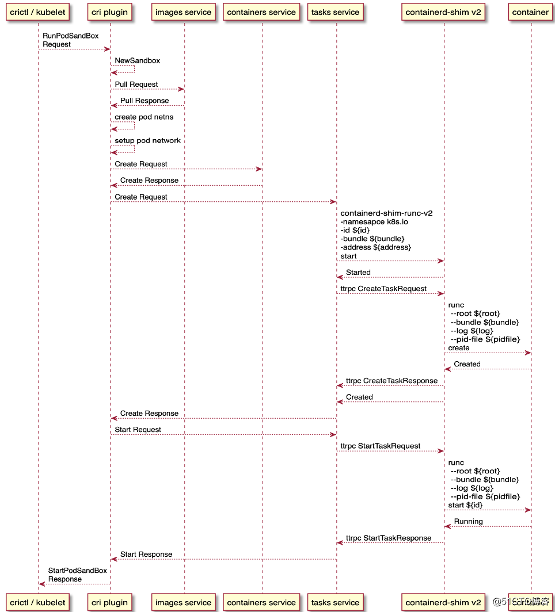

# containerd源码分析
Analyze source code structure of [containerd project](https://github.com/containerd/containerd/)

- Containerd初始化
- Plugin机制
- Content服务
- Snapshot服务
- Metadata服务
- Diff服务
- container服务
- Runtime服务
- Task服务
- 代码路径ctr_run_image
- 代码路径ctr_pull_image 

